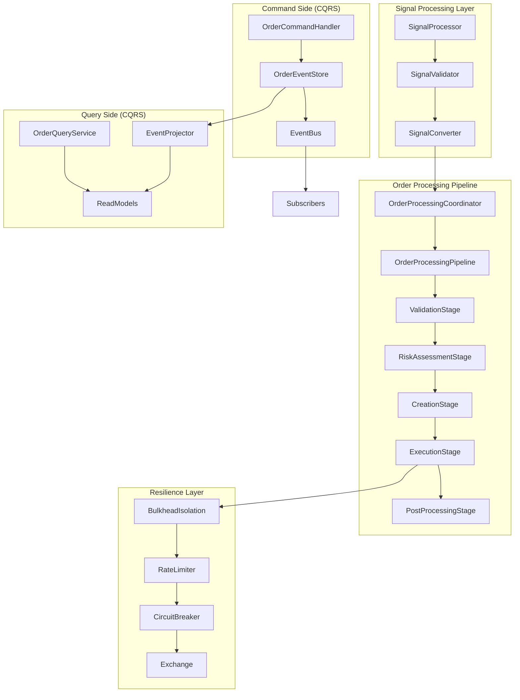

# Order Processing System Redesign Specification

## Architecture Overview

This document outlines the complete redesign of the order processing section (signal generation → exchange processing) using enterprise-grade C# patterns optimized for high-performance trading systems.

## Core Design Principles

### 1. **CQRS (Command Query Responsibility Segregation)**
- Separate write operations (order commands) from read operations (order queries)
- Optimized data structures for each concern
- Event sourcing for complete audit trails

### 2. **Pipeline Pattern**
- Chain of processing stages with single responsibilities
- Pluggable and testable components
- Asynchronous processing with backpressure handling

### 3. **Event-Driven Architecture**
- Reactive processing using System.Threading.Channels
- Immutable event streams
- Loose coupling between components

### 4. **Circuit Breaker & Resilience**
- Fault tolerance for exchange connectivity
- Graceful degradation under load
- Automatic recovery mechanisms

## Component Architecture



## Core Interfaces Design

### IOrderProcessingPipeline
```csharp
/// <summary>
/// High-performance order processing pipeline with pluggable stages
/// Uses ValueTask for optimized async performance
/// </summary>
public interface IOrderProcessingPipeline
{
    ValueTask<OrderProcessingResult> ProcessSignalAsync(
        Signal signal, 
        OrderProcessingContext context,
        CancellationToken cancellationToken = default);
    
    IOrderProcessingPipeline AddStage<TStage>() where TStage : class, IOrderProcessingStage;
    IOrderProcessingPipeline RemoveStage<TStage>() where TStage : class, IOrderProcessingStage;
    
    OrderPipelineMetrics GetMetrics();
    Task<HealthCheckResult> CheckHealthAsync();
}
```

### IOrderProcessingStage
```csharp
/// <summary>
/// Individual processing stage with single responsibility
/// Immutable context passing for thread safety
/// </summary>
public interface IOrderProcessingStage
{
    string StageName { get; }
    int Priority { get; }
    
    ValueTask<StageResult> ProcessAsync(
        OrderProcessingContext context,
        CancellationToken cancellationToken = default);
    
    ValueTask<bool> CanProcessAsync(OrderProcessingContext context);
    StageMetrics GetMetrics();
}
```

### IOrderCommandHandler (CQRS Write Side)
```csharp
/// <summary>
/// Command handler implementing event sourcing pattern
/// Optimized for write operations with minimal contention
/// </summary>
public interface IOrderCommandHandler
{
    ValueTask<CommandResult> HandleAsync<TCommand>(
        TCommand command, 
        CancellationToken cancellationToken = default)
        where TCommand : IOrderCommand;
    
    ValueTask<CommandResult> HandleBatchAsync<TCommand>(
        ReadOnlyMemory<TCommand> commands,
        CancellationToken cancellationToken = default)
        where TCommand : IOrderCommand;
}
```

### IOrderQueryService (CQRS Read Side)
```csharp
/// <summary>
/// Query service with optimized read models
/// Lock-free data structures for high concurrency
/// </summary>
public interface IOrderQueryService
{
    ValueTask<Order?> GetOrderAsync(OrderId orderId);
    ValueTask<IReadOnlyList<Order>> GetActiveOrdersAsync(Symbol? symbol = null);
    ValueTask<OrderStatistics> GetStatisticsAsync(Symbol? symbol = null);
    ValueTask<IReadOnlyList<Order>> GetOrderHistoryAsync(OrderQuery query);
    
    // Real-time subscriptions
    IAsyncEnumerable<OrderStateChange> SubscribeToOrderChangesAsync(
        OrderSubscription subscription,
        CancellationToken cancellationToken = default);
}
```

### IOrderEventStore (Event Sourcing)
```csharp
/// <summary>
/// Event store for complete order lifecycle audit
/// Optimized for append-only operations
/// </summary>
public interface IOrderEventStore
{
    ValueTask AppendEventsAsync(
        StreamId streamId, 
        ReadOnlyMemory<IOrderEvent> events,
        int expectedVersion,
        CancellationToken cancellationToken = default);
    
    IAsyncEnumerable<IOrderEvent> ReadEventsAsync(
        StreamId streamId,
        int fromVersion = 0,
        CancellationToken cancellationToken = default);
    
    ValueTask<T?> ProjectAsync<T>(
        StreamId streamId, 
        IEventProjector<T> projector,
        CancellationToken cancellationToken = default)
        where T : class;
    
    IAsyncEnumerable<IOrderEvent> ReadAllEventsAsync(
        DateTime? fromTimestamp = null,
        CancellationToken cancellationToken = default);
}
```

## Processing Stages Implementation

### 1. ValidationStage
```csharp
/// <summary>
/// Signal and order parameter validation
/// Fast-fail with detailed error messages
/// </summary>
public sealed class ValidationStage : IOrderProcessingStage
{
    public string StageName => "Validation";
    public int Priority => 100;
    
    public async ValueTask<StageResult> ProcessAsync(
        OrderProcessingContext context,
        CancellationToken cancellationToken = default)
    {
        // High-performance validation using Span<T> and stackalloc
        var validationErrors = ValidateSignal(context.Signal);
        
        if (validationErrors.Count > 0)
        {
            return StageResult.Failed(
                $"Validation failed: {string.Join(", ", validationErrors)}");
        }
        
        return StageResult.Success();
    }
    
    private List<string> ValidateSignal(Signal signal)
    {
        var errors = new List<string>();
        
        // Business rule validations
        if (signal.Quantity.IsZero)
            errors.Add("Quantity cannot be zero");
            
        if (signal.Confidence < 0.1)
            errors.Add("Signal confidence too low");
            
        // Price validation using decimal precision
        if (signal.TargetPrice?.Value <= 0)
            errors.Add("Invalid target price");
            
        return errors;
    }
}
```

### 2. RiskAssessmentStage
```csharp
/// <summary>
/// Pre-trade risk assessment with circuit breaker integration
/// Integrates with existing IRiskManager
/// </summary>
public sealed class RiskAssessmentStage : IOrderProcessingStage
{
    private readonly IRiskManager _riskManager;
    private readonly ICircuitBreaker _circuitBreaker;
    
    public string StageName => "RiskAssessment";
    public int Priority => 200;
    
    public async ValueTask<StageResult> ProcessAsync(
        OrderProcessingContext context,
        CancellationToken cancellationToken = default)
    {
        // Circuit breaker pattern for risk service failures
        var riskResult = await _circuitBreaker.ExecuteAsync(async () =>
        {
            var mockOrder = CreateMockOrder(context.Signal);
            return await _riskManager.CheckPreTradeRiskAsync(mockOrder);
        });
        
        if (!riskResult.Passed)
        {
            return StageResult.Failed($"Risk check failed: {riskResult.RejectionReason}");
        }
        
        // Enhance context with risk metrics
        context.SetRiskLevel(riskResult.RiskLevel);
        context.SetRiskDetails(riskResult.Details);
        
        return StageResult.Success();
    }
}
```

### 3. CreationStage
```csharp
/// <summary>
/// Order creation with command pattern
/// Handles bracket orders (take profit/stop loss)
/// </summary>
public sealed class CreationStage : IOrderProcessingStage
{
    private readonly IOrderCommandHandler _commandHandler;
    private readonly ISignalToOrderConverter _converter;
    
    public string StageName => "Creation";
    public int Priority => 300;
    
    public async ValueTask<StageResult> ProcessAsync(
        OrderProcessingContext context,
        CancellationToken cancellationToken = default)
    {
        // Convert signal to order command using strategy pattern
        var createOrderCommand = await _converter.ConvertAsync(
            context.Signal, 
            context.RiskLevel, 
            cancellationToken);
        
        // Execute command through CQRS handler
        var result = await _commandHandler.HandleAsync(
            createOrderCommand, 
            cancellationToken);
        
        if (!result.IsSuccess)
        {
            return StageResult.Failed($"Order creation failed: {result.ErrorMessage}");
        }
        
        context.SetOrderId(result.OrderId);
        
        // Handle bracket orders asynchronously
        if (context.Signal.TakeProfit.HasValue || context.Signal.StopLoss.HasValue)
        {
            _ = Task.Run(() => CreateBracketOrdersAsync(context, cancellationToken));
        }
        
        return StageResult.Success();
    }
}
```

### 4. ExecutionStage
```csharp
/// <summary>
/// Exchange routing with resilience patterns
/// Circuit breaker, retry, and bulkhead isolation
/// </summary>
public sealed class ExecutionStage : IOrderProcessingStage
{
    private readonly IExchange _exchange;
    private readonly ICircuitBreaker _circuitBreaker;
    private readonly IRateLimiter _rateLimiter;
    private readonly IBulkheadIsolation _bulkhead;
    
    public string StageName => "Execution";
    public int Priority => 400;
    
    public async ValueTask<StageResult> ProcessAsync(
        OrderProcessingContext context,
        CancellationToken cancellationToken = default)
    {
        var order = context.Order ?? throw new InvalidOperationException("Order not created");
        
        // Rate limiting to prevent exchange overload
        await _rateLimiter.WaitAsync(cancellationToken);
        
        // Bulkhead isolation for exchange operations
        var executionResult = await _bulkhead.ExecuteAsync(async () =>
        {
            // Circuit breaker for exchange connectivity
            return await _circuitBreaker.ExecuteAsync(async () =>
            {
                return await _exchange.SubmitOrderAsync(order);
            });
        });
        
        if (!executionResult)
        {
            return StageResult.Failed("Exchange submission failed");
        }
        
        return StageResult.Success();
    }
}
```

### 5. PostProcessingStage
```csharp
/// <summary>
/// Final processing with metrics, logging, and event publishing
/// Non-blocking operations for optimal performance
/// </summary>
public sealed class PostProcessingStage : IOrderProcessingStage
{
    private readonly IEventBus _eventBus;
    private readonly IMetricsCollector _metrics;
    private readonly ILogger<PostProcessingStage> _logger;
    
    public string StageName => "PostProcessing";
    public int Priority => 500;
    
    public async ValueTask<StageResult> ProcessAsync(
        OrderProcessingContext context,
        CancellationToken cancellationToken = default)
    {
        var processingTime = context.GetProcessingTime();
        
        // Fire-and-forget metrics collection
        _ = Task.Run(() => _metrics.RecordOrderProcessingTime(processingTime));
        
        // Publish order created event
        var orderCreatedEvent = new OrderCreatedEvent(
            context.OrderId!.Value,
            context.Signal,
            Timestamp.Now);
            
        await _eventBus.PublishAsync(orderCreatedEvent, cancellationToken);
        
        // Structured logging for observability
        _logger.LogInformation(
            "Order {OrderId} processed successfully for {Symbol} in {ProcessingTime}ms",
            context.OrderId,
            context.Signal.Symbol,
            processingTime.TotalMilliseconds);
        
        return StageResult.Success();
    }
}
```

## High-Performance Data Structures

### OrderProcessingContext (Immutable)
```csharp
/// <summary>
/// Immutable context for pipeline processing
/// Uses record types for structural equality and reduced allocations
/// </summary>
public sealed record OrderProcessingContext
{
    public Signal Signal { get; init; }
    public OrderId? OrderId { get; private set; }
    public Order? Order { get; private set; }
    public RiskLevel RiskLevel { get; private set; }
    public IReadOnlyDictionary<string, object> Properties { get; private set; } = 
        new Dictionary<string, object>();
    public Timestamp StartTime { get; init; } = Timestamp.Now;
    
    public OrderProcessingContext SetOrderId(OrderId orderId) =>
        this with { OrderId = orderId };
        
    public OrderProcessingContext SetOrder(Order order) =>
        this with { Order = order };
        
    public OrderProcessingContext SetRiskLevel(RiskLevel riskLevel) =>
        this with { RiskLevel = riskLevel };
        
    public OrderProcessingContext SetProperty(string key, object value)
    {
        var newProperties = new Dictionary<string, object>(Properties) { [key] = value };
        return this with { Properties = newProperties };
    }
    
    public TimeSpan GetProcessingTime() => Timestamp.Now.Value - StartTime.Value;
}
```

### Lock-Free Read Models
```csharp
/// <summary>
/// High-performance read model using lock-free data structures
/// Optimized for concurrent reads with minimal write contention
/// </summary>
public sealed class OrderReadModel
{
    private readonly ConcurrentDictionary<OrderId, OrderSnapshot> _orders = new();
    private readonly ConcurrentDictionary<Symbol, ImmutableList<OrderId>> _ordersBySymbol = new();
    private volatile OrderStatistics _statistics = new();
    
    public ValueTask<OrderSnapshot?> GetOrderAsync(OrderId orderId)
    {
        _orders.TryGetValue(orderId, out var order);
        return ValueTask.FromResult(order);
    }
    
    public ValueTask<IReadOnlyList<OrderSnapshot>> GetOrdersBySymbolAsync(Symbol symbol)
    {
        if (!_ordersBySymbol.TryGetValue(symbol, out var orderIds))
        {
            return ValueTask.FromResult<IReadOnlyList<OrderSnapshot>>(Array.Empty<OrderSnapshot>());
        }
        
        var orders = orderIds
            .Select(id => _orders.TryGetValue(id, out var order) ? order : null)
            .Where(order => order != null)
            .ToList()!;
            
        return ValueTask.FromResult<IReadOnlyList<OrderSnapshot>>(orders);
    }
    
    public void UpdateOrder(OrderSnapshot order)
    {
        _orders.AddOrUpdate(order.Id, order, (_, _) => order);
        
        // Update symbol index using lock-free operations
        _ordersBySymbol.AddOrUpdate(
            order.Symbol,
            ImmutableList.Create(order.Id),
            (_, existing) => existing.Contains(order.Id) ? existing : existing.Add(order.Id));
    }
}
```

## Circuit Breaker Implementation

### ICircuitBreaker Interface
```csharp
/// <summary>
/// Circuit breaker for fault tolerance
/// Prevents cascading failures in distributed systems
/// </summary>
public interface ICircuitBreaker
{
    ValueTask<T> ExecuteAsync<T>(Func<ValueTask<T>> operation);
    ValueTask ExecuteAsync(Func<ValueTask> operation);
    
    CircuitBreakerState State { get; }
    CircuitBreakerMetrics GetMetrics();
    
    event EventHandler<CircuitBreakerStateChangedEventArgs> StateChanged;
}

public enum CircuitBreakerState
{
    Closed,    // Normal operation
    Open,      // Failing fast
    HalfOpen   // Testing if service recovered
}
```

### CircuitBreaker Implementation
```csharp
/// <summary>
/// High-performance circuit breaker with exponential backoff
/// Thread-safe implementation using interlocked operations
/// </summary>
public sealed class CircuitBreaker : ICircuitBreaker
{
    private readonly CircuitBreakerOptions _options;
    private readonly ISystemClock _clock;
    private volatile CircuitBreakerState _state = CircuitBreakerState.Closed;
    
    private long _failureCount;
    private long _successCount;
    private long _lastFailureTimeTicks;
    private long _lastStateChangeTimeTicks;
    
    public CircuitBreakerState State => _state;
    
    public async ValueTask<T> ExecuteAsync<T>(Func<ValueTask<T>> operation)
    {
        if (_state == CircuitBreakerState.Open)
        {
            if (ShouldAttemptReset())
            {
                return await AttemptResetAsync(operation);
            }
            
            throw new CircuitBreakerOpenException("Circuit breaker is open");
        }
        
        try
        {
            var result = await operation();
            OnSuccess();
            return result;
        }
        catch (Exception ex)
        {
            OnFailure();
            throw;
        }
    }
    
    private void OnSuccess()
    {
        Interlocked.Increment(ref _successCount);
        
        if (_state == CircuitBreakerState.HalfOpen)
        {
            TransitionTo(CircuitBreakerState.Closed);
        }
    }
    
    private void OnFailure()
    {
        var failures = Interlocked.Increment(ref _failureCount);
        Interlocked.Exchange(ref _lastFailureTimeTicks, _clock.UtcNow.Ticks);
        
        if (failures >= _options.FailureThreshold && _state == CircuitBreakerState.Closed)
        {
            TransitionTo(CircuitBreakerState.Open);
        }
        else if (_state == CircuitBreakerState.HalfOpen)
        {
            TransitionTo(CircuitBreakerState.Open);
        }
    }
}
```

## Performance Optimizations

### 1. Memory Management
- **Struct-based value objects** to reduce GC pressure
- **ArrayPool<T>** for buffer reuse
- **Span<T>** and **Memory<T>** for zero-copy operations
- **Object pooling** for frequently allocated objects

### 2. Concurrent Processing
- **Channel<T>** for producer-consumer patterns
- **Interlocked operations** for atomic counters
- **Memory barriers** instead of heavyweight locks
- **SIMD vectorization** for bulk operations

### 3. Async Optimization
- **ValueTask<T>** for hot paths to avoid allocations
- **ConfigureAwait(false)** for library code
- **Cancellation token propagation** throughout the pipeline
- **Async enumerable** for streaming operations

### 4. CPU Cache Optimization
- **Data locality** with cache-friendly layouts
- **False sharing avoidance** with proper padding
- **Branch prediction optimization** in hot loops
- **Prefetching** for predictable data access patterns

## Integration Points

### 1. TradingPipeline Integration
```csharp
// Replace current OrderRouter with OrderProcessingCoordinator
private readonly IOrderProcessingCoordinator _orderProcessingCoordinator;

// In InitializeEventHandlers():
_strategyEngine.SignalGenerated += async (sender, signal) =>
{
    await _orderProcessingCoordinator.ProcessSignalAsync(signal);
};
```

### 2. Risk Manager Integration
```csharp
// RiskAssessmentStage uses existing IRiskManager
public RiskAssessmentStage(IRiskManager riskManager, ICircuitBreaker circuitBreaker)
{
    _riskManager = riskManager;
    _circuitBreaker = circuitBreaker;
}
```

### 3. Exchange Integration
```csharp
// ExecutionStage integrates with existing IExchange
public ExecutionStage(
    IExchange exchange, 
    ICircuitBreaker circuitBreaker,
    IRateLimiter rateLimiter,
    IBulkheadIsolation bulkhead)
{
    _exchange = exchange;
    _circuitBreaker = circuitBreaker;
    _rateLimiter = rateLimiter;
    _bulkhead = bulkhead;
}
```

## Configuration

### Pipeline Configuration
```csharp
public sealed class OrderProcessingConfiguration
{
    public int MaxConcurrentOrders { get; set; } = 1000;
    public TimeSpan ProcessingTimeout { get; set; } = TimeSpan.FromSeconds(30);
    public int RetryAttempts { get; set; } = 3;
    public TimeSpan RetryDelay { get; set; } = TimeSpan.FromMilliseconds(100);
    
    public CircuitBreakerOptions CircuitBreaker { get; set; } = new();
    public RateLimiterOptions RateLimiter { get; set; } = new();
    public BulkheadOptions Bulkhead { get; set; } = new();
    
    public EventSourcingOptions EventSourcing { get; set; } = new();
    public MetricsOptions Metrics { get; set; } = new();
}
```

## Monitoring & Observability

### 1. Structured Logging
```csharp
_logger.LogInformation(
    "Order processing completed for {OrderId} on {Symbol} with {ProcessingTime}ms latency",
    orderId,
    symbol,
    processingTime.TotalMilliseconds);
```

### 2. Metrics Collection
```csharp
// Performance counters
counter.WithTag("stage", stageName).Add(1);
histogram.Record(processingTime.TotalMilliseconds);

// Business metrics
_metrics.IncrementOrdersProcessed(symbol);
_metrics.RecordProcessingLatency(processingTime);
```

### 3. Distributed Tracing
```csharp
using var activity = ActivitySource.StartActivity("OrderProcessing");
activity?.SetTag("order.id", orderId.ToString());
activity?.SetTag("signal.symbol", signal.Symbol.Value);
```

## Testing Strategy

### 1. Unit Testing
- Individual stage testing with mocked dependencies
- Command/query handler testing
- Circuit breaker state machine testing

### 2. Integration Testing
- Pipeline end-to-end testing
- Event sourcing replay testing
- Performance benchmarking with BenchmarkDotNet

### 3. Load Testing
- Throughput testing (orders/second)
- Latency testing (p99 processing time)
- Resilience testing (circuit breaker functionality)

## Migration Strategy

### Phase 1: Core Infrastructure
1. Implement core interfaces and data structures
2. Create basic pipeline without processing stages
3. Add event sourcing infrastructure

### Phase 2: Processing Stages
1. Implement ValidationStage
2. Implement RiskAssessmentStage with existing IRiskManager
3. Implement CreationStage with command pattern

### Phase 3: Execution & Resilience
1. Implement ExecutionStage with circuit breaker
2. Add rate limiting and bulkhead isolation
3. Integrate with existing exchange

### Phase 4: Advanced Features
1. Add comprehensive metrics and monitoring
2. Implement query service with optimized read models
3. Add performance optimizations and tuning

This architecture provides a solid foundation for a high-performance, enterprise-grade order processing system that demonstrates advanced C# development skills while maintaining compatibility with your existing trading engine components.